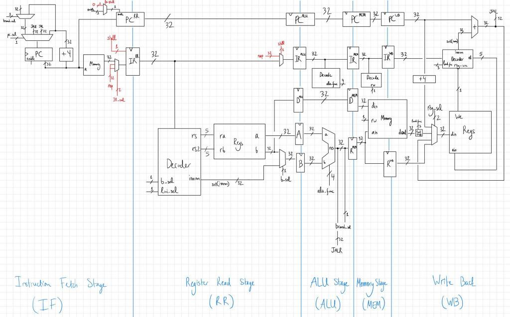

# Risky CPU:

### Note:

The CPU is currently being developed and thus is not fully functional yet. There are pipeline errors to solve, always more.

## About

This project defines a Verilog model for a CPU which implements a subset of the RISC-V 32-bit architecture. The models are tested using Verilator, a cycle-based simulator.

The CPU implements a 5-stage pipeline: instruction fetch (IF), register read (RR), arithmetic (ALU), memory (MEM) and write-back (WB). Data and control hazards are handled by stalling. For the case of control hazards, when a branch or jump instruction is detected, we stall the pipeline until its outcome is determined in the ALU stage. This is achieved by inserting two NOP operations into the pipeline.

## How to simulate:

To run the assembler run

`python ./asm/asm.py ./asm/tests/{your_asm_here}.s > memory.list`

To simulate the machine, simply run `make`. If you want to use gtkwave to take a peek at the signals run `make waves`.

## Supported instructions:

Throughout this section we denote the contents stored at a particular register `xs` as `[xs]`.

| Instruction        | Description |
|--------------------|-------------|
| `addi xd, xs, imm` | Adds the sign-extended immediate `imm` to `[xs]` and stores the result in `xd`. |
| `slti xd, xs, imm` | Sets `xd` to 1 if `[xs]` is less than the sign-extended immediate `imm`. |
| `sltiu xd, xs, imm`| Same as `slti` but where `[xd]` and `imm` are unsigned. |
| `andi xd, xs, imm` | Stores the bitwise and of `[xs]` and `imm` in `xd`. | 

## Bugs:

1. Stalling works, but skips the next instruction immediately following. We do not want this.

## Roadmap:

0. Add exception and interrupt support.
1. Add an MMU and virtual memory support.
2. Code a bootloader.
3. Write a basic OS that supports multiple processes (need interrupts, scheduler).
4. Ethernet driver.
5. TCP/IP stack.

## Bibliography:

[RISC-V specifications](https://github.com/riscv/riscv-isa-manual/releases/tag/draft-20220723-10eea63)

[MIT 6.004 Computational Structures, Spring 2017, Lectures](https://youtu.be/R0tFDXBZvKI)

[lightcode's 8bit-computer github project](https://github.com/lightcode/8bit-computer)

[ZipCPU blog on Verilator](http://zipcpu.com/blog/2017/06/21/looking-at-verilator.html)