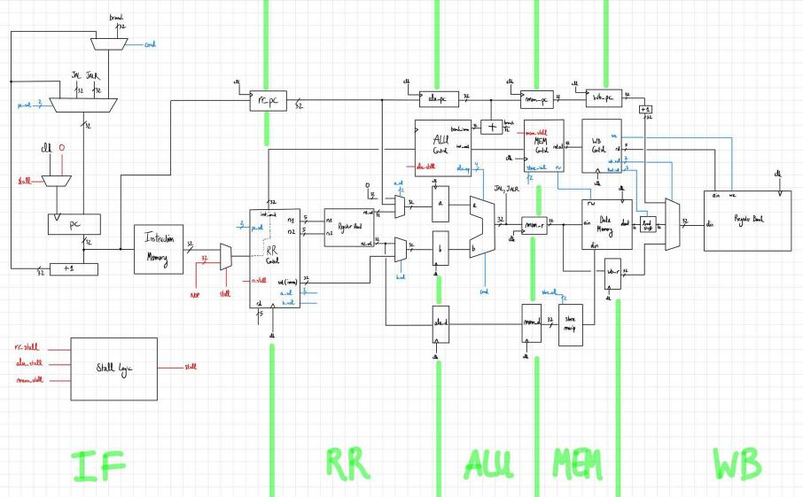

# Risky CPU:

This project defines a Verilog model for a CPU which implements a subset of the RISC-V 32-bit architecture. The models are tested using Verilator, a cycle-based simulator.

The CPU implements a 5-stage pipeline: instruction fetch (IF), register read (RR), arithmetic (ALU), memory (MEM) and write-back (WB). Data and control hazards are handled by stalling. For the case of control hazards, when a branch or jump instruction is detected, we stall the pipeline until its outcome is determined in the ALU stage. This is achieved by inserting two NOP operations into the pipeline.

## How to simulate:

To run the assembler run

`python ./asm/asm.py ./asm/tests/{your_asm_here}.s > memory.list`

To simulate the machine, simply run `make`. If you want to use gtkwave to take a peek at the signals run `make waves`.

## Supported instructions:

Throughout this section we denote the contents stored at a particular register `xs` as `[xs]`.

### Instructions on immediates

For brievity, we denote the 32-bit sign-extended value of the immediate `imm` as `sext(imm)`. Additionally, we assume `imm` is a 12-bit value unless otherwise stated. Finally, we use the notation `{a, b}` to denote the concatenation of `a` and `b` and `a^b = {a, a, ..., a}` b times. For example `{011, 1001} = 0111001` and `{110, 0^5} = 11000000`. 

| Instruction        | Description |
|--------------------|-------------|
| `addi xd, xs, imm` | Adds `sext(imm)` to `[xs]` and stores the result in `xd`. |
| `slti xd, xs, imm` | Sets `xd` to 1 if signed `[xs]` is less than `sext(imm)`. |
| `sltiu xd, xs, imm`| Same as `slti`, but where `[xd]` and `imm` are unsigned. |
| `andi xd, xs, imm` | Stores the bitwise and of `[xs]` and `imm` in `xd`. | 
| `ori xd, xs, imm` | Stores the bitwise or of `[xs]` and `imm` in `xd`. |
| `xori xd, xs, imm` | Stores the bitwise xor of `[xs]` and `imm` in `xd`. |
| `slli xd, xs, imm` | Stores the left `imm`-shift of `[xs]` in `xd`. |
| `srli xd, xs, imm` | Same as `slli`, but with a right shift. |
| `srai xd, xs, imm` | Stores the right `imm`-arithmetic shift of `[xs]` in `xd`. |
| `lui xd, imm20` | Stores `{imm20, 0^12}` in `xd`. |
| `auipc xd, imm20` | Adds `{imm20, 0^12}` to the address of the `auipc` instruction and stores the result in `xd`. |

### Register-to-register instructions

| Instruction        | Description |
|--------------------|-------------|
| `add xd, xs1, xs2` | Stores the result of `[xs1] + [xs2]` in `xd`. |
| `sub xd, xs1, xs2` | Stores the result of `[xs1] - [xs2]` in `xd`. |
| `slt xd, xs1, xs2` | Sets `xd` to 1 if signed `[xs1]` is less than signed `[xs2]`. |
| `sltu xd, xs1, xs2` | Same as `slt`, but where `[xs1]` and `[xs2]` are unsigned. |
| `and xd, xs1, xs2` | Stores the bitwise and of `[xs1]` and `[xs2]` in `xd`. |
| `or xd, xs1, xs2` | Stores the bitwise or of `[xs1]` and `[xs2]` in `xd`. |
| `xor xd, xs1, xs2` | Stores the bitwise xor of `[xs1]` and `[xs2]` in `xd`. |
| `sll xd, xs1, xs2` | Stores the left `[xs2]`-shift of `[xs1]` in `xd`. |
| `srl xd, xs1, xs2` | Same as `sll`, but with right shift. |
| `sra xs, xs1, xs2` | Stores the right `[xs2]`-arithmetic shift of `[xs1]` in `xd`. |

### Control transfer instructions

| Instruction        | Description |
|--------------------|-------------|
| `jal xd, imm20` | Loads `[pc] + sext(imm20)` into the program counter (`pc`) and stores `[pc] + 1` in `xd`. |
| `jalr xd, xs, imm` | Loads `[xs] + sext(imm12)` into the `pc` and stores `[pc] + 1` in `xd`. |
| `beq xs1, xs2, imm` | Loads `[pc] + sext(imm12)` into the program counter if `[xs1] != [xs2]`. |
| `beq xs1, xs2, imm` | Loads `[pc] + sext(imm12)` into the program counter if `[xs1] == [xs2]`. |
| `bne xs1, xs2, imm` | Loads `[pc] + sext(imm12)` into the program counter if `[xs1] != [xs2]`. |
| `blt xs1, xs2, imm` | Loads `[pc] + sext(imm12)` into the program counter if signed `[xs1]` is less than signed `[xs2]`. |
| `bltu xs1, xs2, imm` | Same as `blt`, but where `[xs1]` and `[xs2]` are unsigned. |
| `bge xs1, xs2, imm` | Loads `[pc] + sext(imm12)` into the program counter if signed `[xs1]` is greater or equal to signed `[xs2]`. |
| `bgeu xs1, xs2, imm` | Same as `bge`, but where `[xs1]` and `[xs2]` are unsigned. |

### Load and store instructions

| Instruction        | Description |
|--------------------|-------------|
| `lw xd, xs, imm` | Copies the value at memory address `[xs] + sext(imm)` into `xd`. |
| `sw xs, xb, imm` | Stores `[xs]` into memory at address `[xb] + sext(imm)`. |

### Pseudo-instructions

| Pseudo-instruction | Instruction | Description |
|--------------------|-------------|-------------|
| `nop` | `addi, x0, x0, 0` | Does not change the internal state of the CPU except for incrementing the `pc`. |
| `mov xd, xs` | `addi xd, xs, 0` | Moves `[xs]` into `xd`. |

## Roadmap:

0. Add an end instruction so that simulator can run until it hits it.
1. Add more pseudoinstructions to the assembler.
2. Add exception and interrupt support.
3. Add an MMU and virtual memory support.
4. Code a bootloader.
5. Write a basic OS that supports multiple processes (need interrupts, scheduler).
6. Ethernet driver.
7. TCP/IP stack.

## Bibliography:

[RISC-V specifications](https://github.com/riscv/riscv-isa-manual/releases/tag/draft-20220723-10eea63)

[MIT 6.004 Computational Structures, Spring 2017, Lectures](https://youtu.be/R0tFDXBZvKI)

[lightcode's 8bit-computer github project](https://github.com/lightcode/8bit-computer)

[ZipCPU blog on Verilator](http://zipcpu.com/blog/2017/06/21/looking-at-verilator.html)

[Geohotz's from the transistor course](https://github.com/geohot/fromthetransistor)